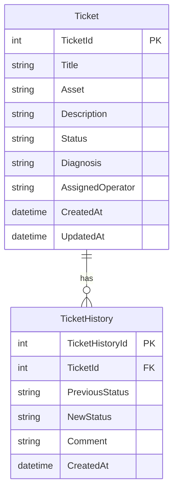

# Data Model

The application uses a relational model composed of two main entities:

- `Ticket`
- `TicketHistory`

A ticket can contain multiple history records.

The relationship is:

```text
Ticket 1 ───── N TicketHistory
```

## Entity Relationship Diagram



## Ticket

The `Ticket` entity represents a maintenance incident.

| Field | Description |
|---|---|
| TicketId | Primary key |
| Title | Short description of the incident |
| Asset | Equipment associated with the incident |
| Description | Detailed description of the problem |
| Status | Current ticket status |
| Diagnosis | Technical diagnosis used when resolving the ticket |
| AssignedOperator | Operator responsible for the ticket |
| CreatedAt | Ticket creation date |
| UpdatedAt | Last status update date |

Possible ticket states are:

```text
Pending
InProgress
Resolved
```

`Diagnosis` can be null until the ticket is resolved.

`AssignedOperator` can be null while the ticket is still pending. An operator is required before the ticket can move to `InProgress`.

## TicketHistory

The `TicketHistory` entity stores every valid ticket status transition.

| Field | Description |
|---|---|
| TicketHistoryId | Primary key |
| TicketId | Foreign key referencing Ticket |
| PreviousStatus | Status before the transition |
| NewStatus | Status after the transition |
| Comment | Optional transition comment |
| CreatedAt | Date when the transition occurred |

## Referential Integrity

`TicketHistory.TicketId` references:

```text
Ticket.TicketId
```

This implements the following relationship:

```text
One Ticket
    |
    +---- Many TicketHistory records
```

The relationship is configured through Entity Framework Core.

When a ticket changes status, the stored procedure updates the ticket and creates its history record inside the same database transaction.

## Ticket Lifecycle

```text
Pending
   |
   | Operator assignment
   v
InProgress
   |
   | Diagnosis
   v
Resolved
```

The business layer validates the transition before the stored procedure is executed.