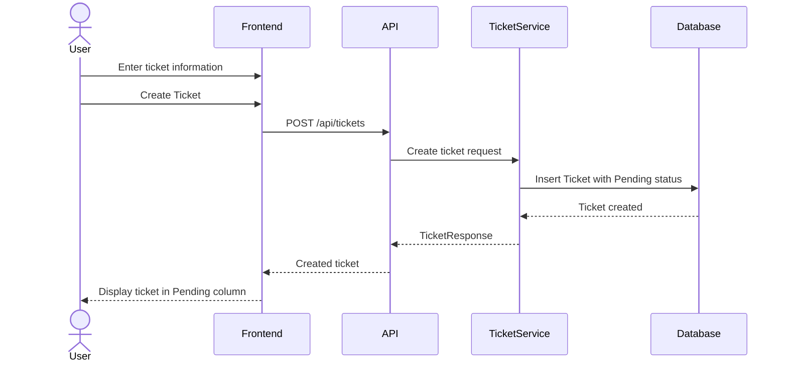
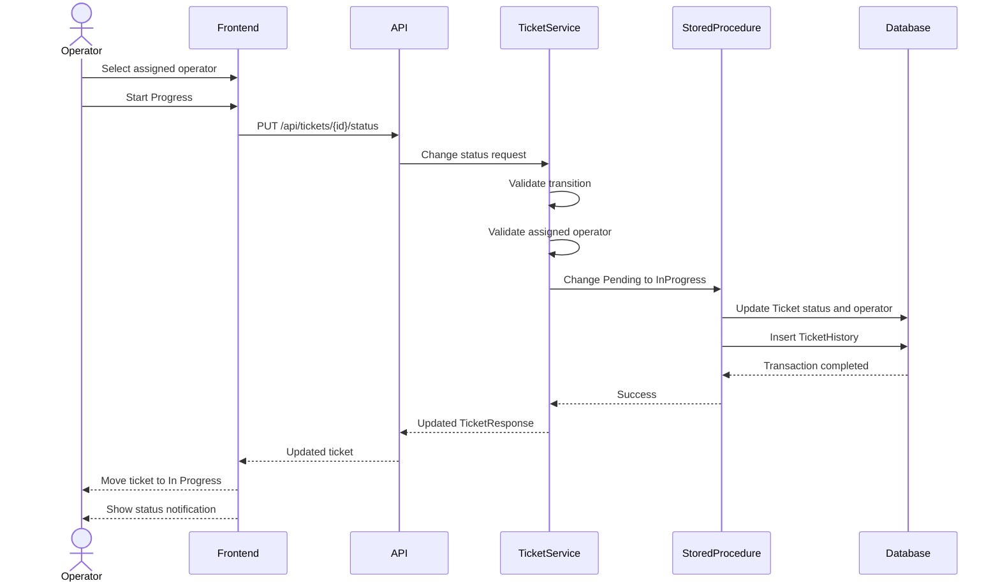
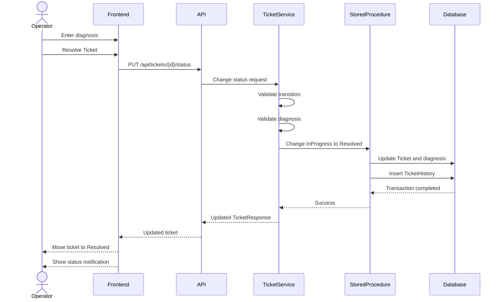

# Sequence Diagrams

## Ticket Creation



## Ticket Status Transition



## Ticket Resolution



## Status Flow

```text
Pending
   |
   | Assigned operator required
   v
InProgress
   |
   | Diagnosis required
   v
Resolved
```