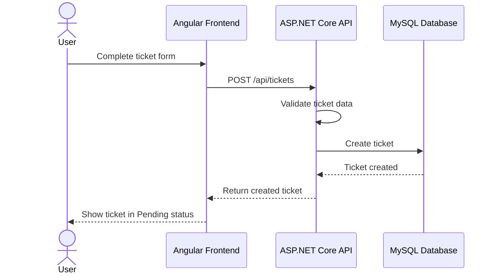
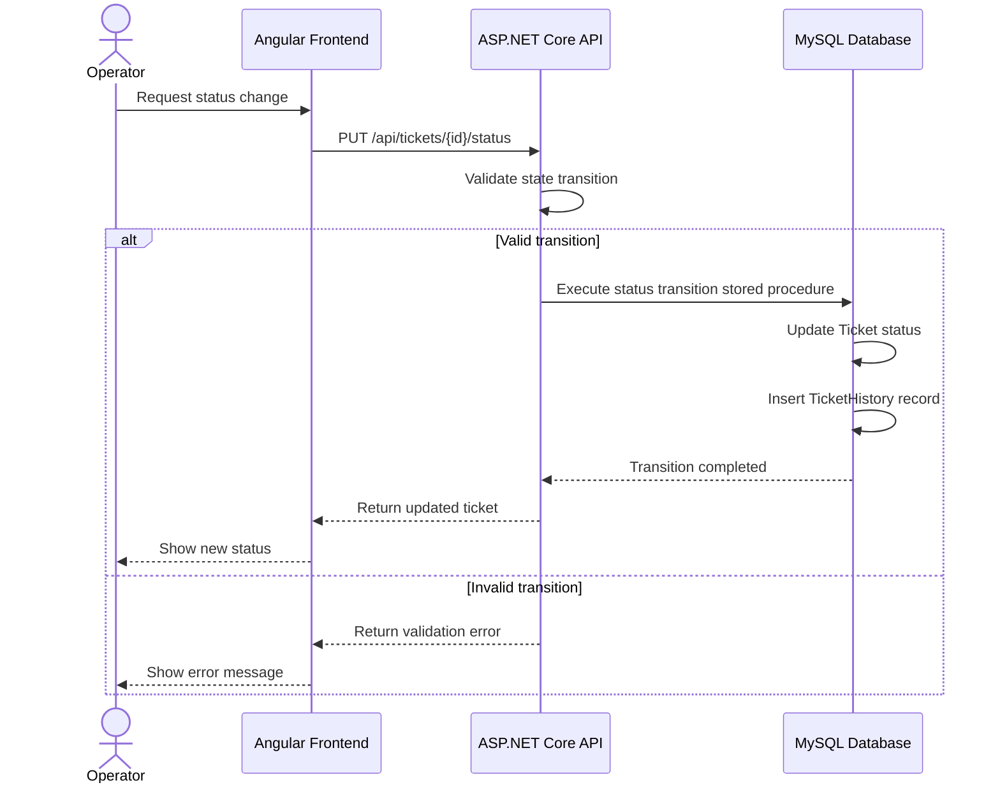

# Sequence Diagrams

## Create Ticket

```mermaid
sequenceDiagram
    actor User
    participant Frontend as Angular Frontend
    participant API as ASP.NET Core API
    participant DB as MySQL Database

    User->>Frontend: Complete ticket form
    Frontend->>API: POST /api/tickets
    API->>API: Validate ticket data
    API->>DB: Create ticket
    DB-->>API: Ticket created
    API-->>Frontend: Return created ticket
    Frontend-->>User: Show ticket in Pending status
```

## Change Ticket Status

```mermaid
sequenceDiagram
    actor Operator
    participant Frontend as Angular Frontend
    participant API as ASP.NET Core API
    participant DB as MySQL Database

    Operator->>Frontend: Request status change
    Frontend->>API: PUT /api/tickets/{id}/status
    API->>API: Validate state transition

    alt Valid transition
        API->>DB: Execute status transition stored procedure
        DB->>DB: Update Ticket status
        DB->>DB: Insert TicketHistory record
        DB-->>API: Transition completed
        API-->>Frontend: Return updated ticket
        Frontend-->>Operator: Show new status
    else Invalid transition
        API-->>Frontend: Return validation error
        Frontend-->>Operator: Show error message
    end
```